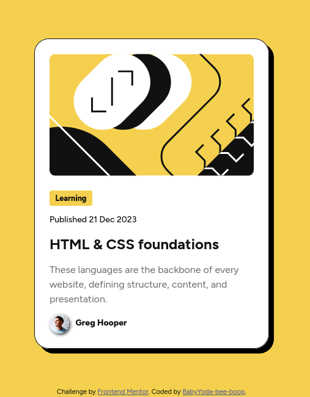
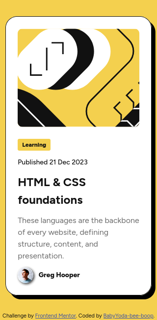

# Frontend Mentor - Blog preview card solution

This is a solution to the [Blog preview card challenge on Frontend Mentor](https://www.frontendmentor.io/challenges/blog-preview-card-ckPaj01IcS). Frontend Mentor challenges help you improve your coding skills by building realistic projects. 

## Table of contents

- [Overview](#overview)
  - [The challenge](#the-challenge)
  - [Screenshot](#screenshot)
  - [Links](#links)
- [My process](#my-process)
  - [Built with](#built-with)
  - [Continued development](#continued-development)
  - [Useful resources](#useful-resources)
- [Author](#author)

## Overview

### The challenge

Users should be able to:

- See hover and focus states for all interactive elements on the page

### Screenshot

 

### Links

- Solution URL: [Click here](https://www.frontendmentor.io/solutions/responsive-fonts-and-spacing-using-clamp-V02LTtmSVX)
- Live Site URL: [Click here](https://wondrous-cactus-557011.netlify.app/)

## My process

### Built with

- Semantic HTML5 markup
- CSS custom properties
- Flexbox

### Continued development

I will optimise the usage of custom properties / variables and do the same project using mostly class modifiers.

### Useful resources

- [font clamp() generator](https://clamp-generator.netlify.app/) - used it to set the fonts and paddings to be responsive to screen width

## Author

- Website - [BabyYoda-bee-boop](https://github.com/BabyYoda-bee-boop)
- Frontend Mentor - [@BabyYoda-bee-boop](https://www.frontendmentor.io/profile/BabyYoda-bee-boop)

